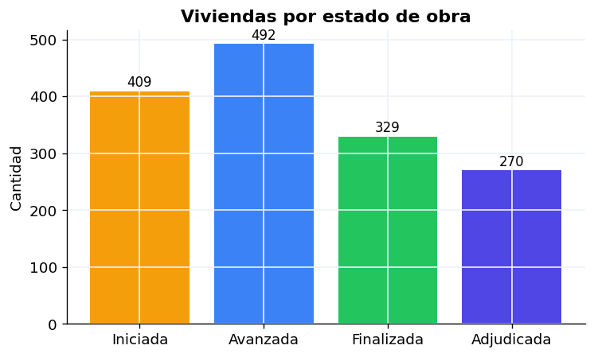
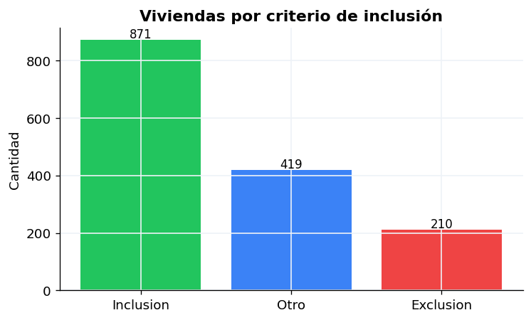
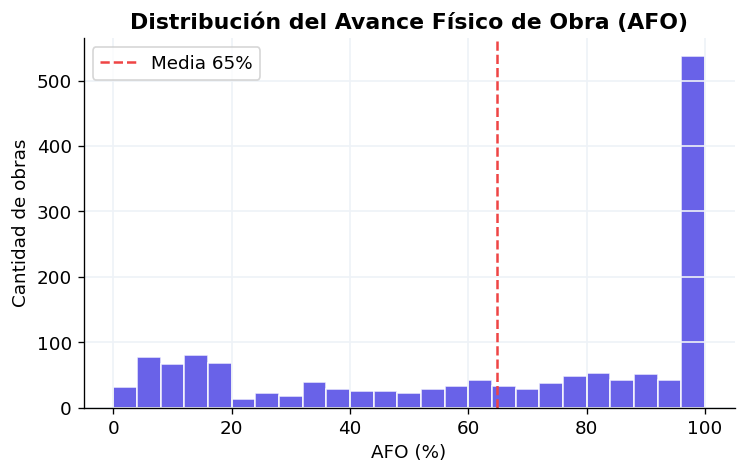
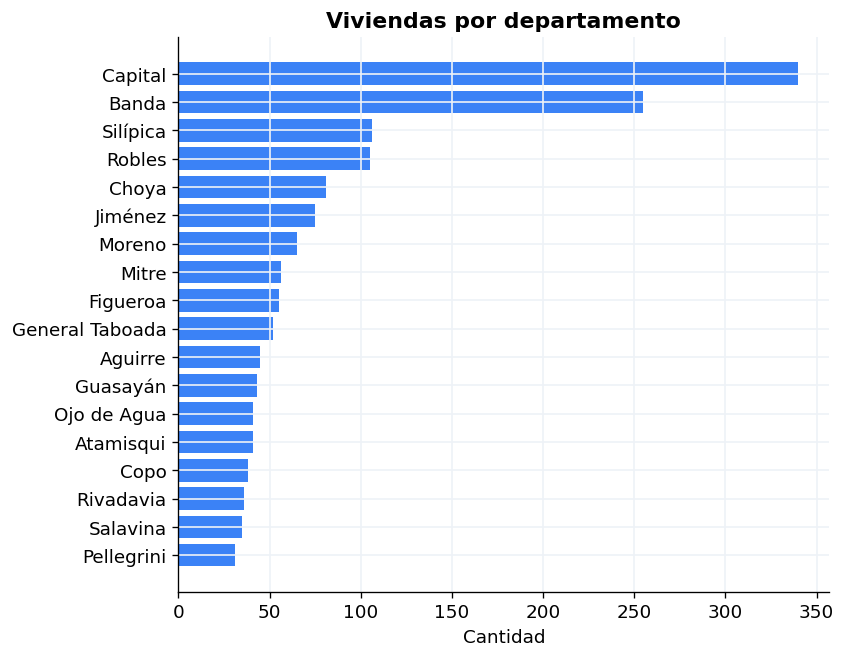
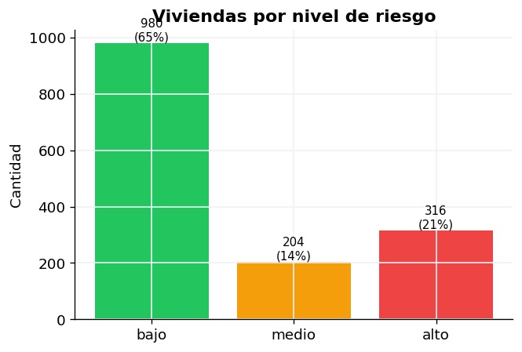
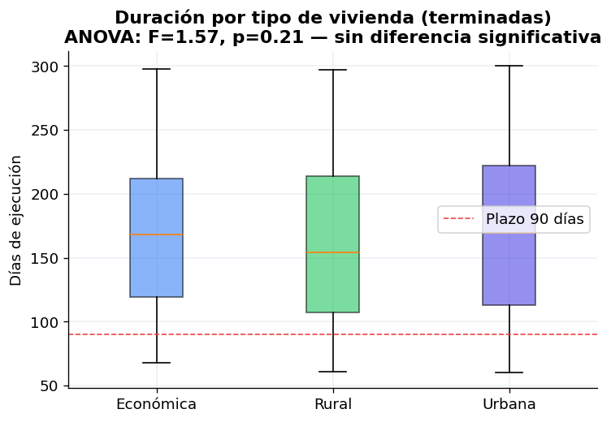
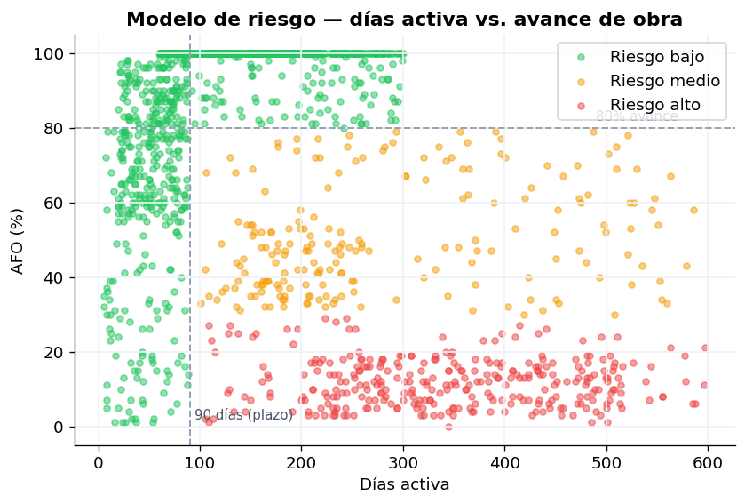
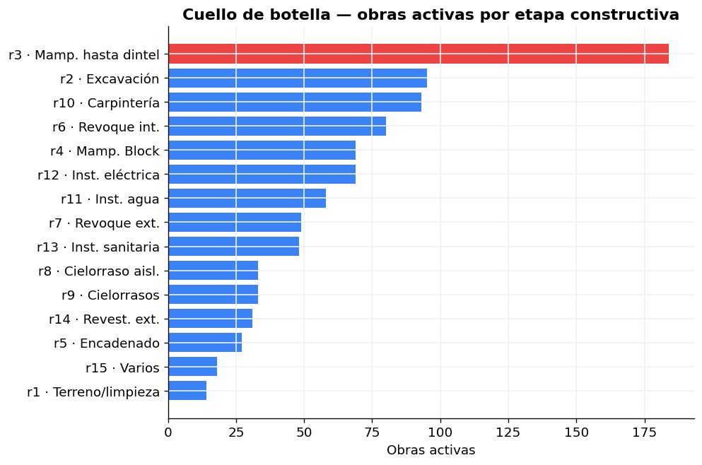
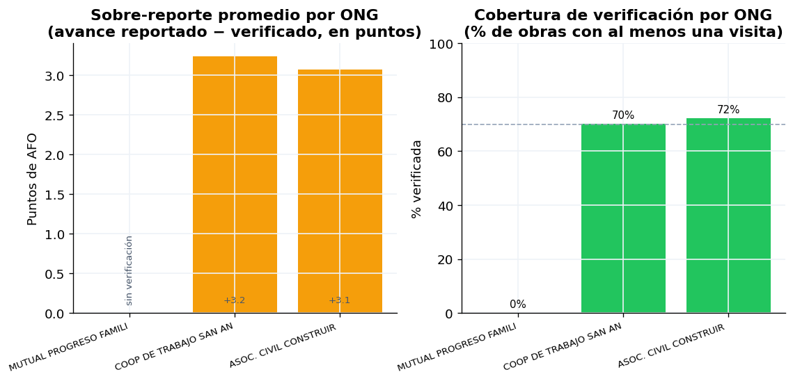

# Informe de Análisis Exploratorio de Datos (EDA)
## Sistema VIVSO — Componente de Ciencia de Datos

**Práctica Profesionalizante PP2 · ITSE · Tecnicatura en Ciencia de Datos e IA**
**Equipo:** Pablo Castillo · Sara Lombardi · Valeria Martinetti · Santiago Gallardo · Enzo Pazzelli
**Entidad:** Subsecretaría de Promoción Humana — Ministerio de Desarrollo Social, Santiago del Estero
**Fecha:** junio 2026

> Este informe consolida en un único documento el análisis exploratorio del programa de
> viviendas sociales: dataset, preprocesamiento, hallazgos con figuras, modelo de riesgo e
> indicadores de gestión. El detalle del *por qué* de cada decisión metodológica está en
> [documentacion-analisis.md](documentacion-analisis.md); el prototipo funcionando, en `dashboard/`.

---

## 1. Introducción

### 1.1 Contexto y problema

La Subsecretaría de Promoción Humana gestiona un programa de viviendas sociales con obras
distribuidas en **18 departamentos** de la provincia, ejecutadas por **Organizaciones No
Gubernamentales (ONGs)** bajo contrato y supervisadas por **técnicos** del ministerio. El
programa está asociado al **Programa Chagas** (mejora habitacional para erradicar el vector).

Antes de VIVSO, la información vivía en tres sistemas legacy desconectados (App GPS, VISOC y
GEDO) y en planillas de papel. El problema central es de **visibilidad y control**:

- ¿Cuántas obras están en riesgo de no terminar a tiempo, y dónde?
- ¿Qué ONGs cumplen y cuáles necesitan seguimiento urgente?
- ¿En qué etapa constructiva se bloquean las obras?
- ¿El avance que reportan las ONGs coincide con lo que verifica el técnico?

### 1.2 Objetivos del análisis

1. Caracterizar el estado del programa con datos estructurados (no narrativos).
2. Construir un **modelo de riesgo transparente** que priorice qué obras atender primero.
3. Producir **indicadores de gestión accionables** (cada uno habilita una decisión concreta).
4. Entregar un **prototipo funcionando** (dashboard) que ponga el análisis frente a cada rol.

### 1.3 Encuadre metodológico

El proyecto combina tres tipos de solución de la cátedra:

| Tipo de solución | Componente en VIVSO |
|---|---|
| **Panel** (tablero de indicadores para dirección pública) | Dashboard Streamlit con KPIs, mapa de riesgo y vistas por rol |
| **Pipeline** (ETL reproducible) | `etl/` + `synthetic/` → base local → datasets procesados |
| **Visión por computadora** (prototipo, PP3) | OCR de formularios de relevamiento (OpenCV + Tesseract) |

El análisis cubre las etapas **3 (Preprocesamiento), 4 (EDA) y 5 (Modelo)** del mapa de la
práctica.

---

## 2. El dataset

### 2.1 Origen y estrategia de datos

El backend Java del equipo de Programación está en desarrollo. Mientras no haya datos reales,
el componente Python genera un **dataset sintético** que reproduce las distribuciones
geográficas y las reglas de negocio reales del programa, sin exponer datos de beneficiarios.
Cuando el backend esté disponible, el pipeline cambia de fuente con una sola variable de
entorno (`API → MySQL → CSV sintético`) sin tocar una línea de análisis.

### 2.2 Composición

| Tabla | Registros | Descripción |
|---|---|---|
| `vivienda` | **1.500** | Una fila por expediente de obra |
| `organizacion` | 3 | ONGs gestoras con sus datos institucionales |
| `tecnico` | 6 | Técnicos con zona de cobertura |
| `asignacion` | 901 | Qué obras tiene asignadas cada técnico |
| `visita` | **1.057** | Cada visita de campo con avance verificado |
| `avance_rubro` | 22.500 | Avance de cada una de las 15 etapas por obra |

### 2.3 Variables clave de cada vivienda

`num_exp` (expediente) · `estado` (Iniciada/Avanzada/Finalizada/Adjudicada) ·
`avance_obra` (AFO 0–100%) · `dias_activa` (derivada) · `clasificacion` (15 códigos) ·
`criterio` (Inclusión/Exclusión/Otro) · `nivel_riesgo` (derivada) · `cuit_org` (ONG, ~21% nulo) ·
`lat`/`lng` (GPS) · `tipo_vivienda` (Urbana/Rural/Económica).

### 2.4 Dominio: clasificaciones y AFO

- **Clasificación:** código VISOC de dos caracteres (15 posibles) agrupado en `criterio`:
  **Inclusión** (apta), **Exclusión** (rechazada), **Otro** (caso especial).
- **AFO (Avance Físico de Obra):** porcentaje 0–100 calculado como **suma ponderada de 15
  rubros estrictamente secuenciales** — el rubro N solo arranca cuando el N-1 terminó. Esta
  restricción permite, dado un AFO, identificar **en qué etapa exacta está cada obra**.

---

## 3. Preprocesamiento (etapa 3)

El dataset crudo no es directamente analizable: fechas como texto, categóricas como strings y
escalas numéricas dispares. El notebook `02_normalizacion` produce un dataset procesado nuevo
(no modifica el original) con estas transformaciones, cada una justificada:

| Transformación | Justificación técnica | Justificación de negocio |
|---|---|---|
| Fechas `texto → datetime` | No se puede restar texto | `dias_activa` requiere aritmética de fechas |
| `dias_activa` (derivada) | No está en el origen | Variable central del modelo de riesgo |
| `anio_inicio` (derivada) | Análisis temporal | Tendencia del programa año a año |
| Inconsistencias **marcadas, no borradas** | Trazabilidad | Informar a Programación qué corregir en el sistema |
| Encoding **manual** de `criterio` | Preserva orden Inclusión→Otro→Exclusión | El encoding alfabético rompería la jerarquía |
| `MinMaxScaler` a [0,1] | Escala uniforme | `dias_activa` (0–600) dominaría sobre `avance` (0–100) |

---

## 4. Análisis exploratorio univariado (etapa 4)

### 4.1 Estado del programa

De las 1.500 obras, **901 están en obra** (Iniciada + Avanzada) y **599 terminadas**
(Finalizada + Adjudicada) → **tasa de finalización del 39,9%**.



### 4.2 Criterio de inclusión

Predomina **Inclusión** (871 obras, el caso típico de intervención), seguido de **Otro** (419)
y **Exclusión** (210). La presencia de obras con criterio Exclusión que muestran avance es una
señal a vigilar: puede indicar errores de selección de beneficiario en el origen.



### 4.3 Distribución del AFO

El AFO promedio es del **64,9%**. El histograma muestra obras repartidas a lo largo de todo el
rango con una acumulación en el 100% (las terminadas).



### 4.4 Distribución geográfica

Las obras se concentran en los departamentos más poblados (Capital, Banda), pero hay presencia
en los 18 departamentos. Esta distribución es la que determina la logística de visitas técnicas.



### 4.5 Nivel de riesgo (primer diagnóstico)

**316 obras (21%) están en riesgo alto** y 204 (14%) en riesgo medio. Casi dos tercios están
sin riesgo. El detalle del modelo que produce esta clasificación está en la sección 6.



---

## 5. Análisis bivariado e inferencial (etapa 4)

Esta sección parte de **hipótesis de negocio** y las contrasta con los datos. Se reportan
también los resultados **negativos**: un hallazgo "no hay diferencia" es información válida.

### 5.1 ¿El criterio de inclusión explica el avance? — **No**

Hipótesis: las obras de criterio Exclusión avanzarían menos que las de Inclusión. Los datos
**no la sostienen**: el avance promedio es prácticamente igual entre las tres categorías
(Exclusión 63,9% · Inclusión 65,0% · Otro 65,3%), y la tasa de riesgo alto también es pareja
(20–22%). **Conclusión:** en este dataset el criterio no es un predictor del avance; el atraso
es transversal y no se concentra en un tipo de beneficiario.

### 5.2 ¿El tipo de vivienda explica la duración? — **No (ANOVA no significativo)**

Hipótesis: las viviendas rurales tardarían más por dificultad de acceso. Se aplicó **ANOVA**
(tres grupos: Urbana/Rural/Económica) en lugar de t-tests múltiples para no inflar el error
tipo I. Resultado: **F = 1,57, p = 0,21** → no hay diferencia estadísticamente significativa
(de hecho las rurales promedian 161 días, menos que las urbanas con 170).



**Implicancia metodológica:** confirmar o descartar esta relación de forma definitiva requiere
**datos reales** — el generador sintético no codificó esa diferencia. Queda como hipótesis a
revisar en PP3 cuando se integre la base del backend.

### 5.3 ¿Qué clasificaciones concentran el riesgo? — **Sí hay señal**

Las obras en riesgo alto se concentran en las clasificaciones más frecuentes del programa: **2a
(Precaria, 74 obras), 1a (Rancho, 61) y 2b (riesgo de derrumbe, 34)**. Esto permite al
ministerio priorizar la supervisión de esos códigos desde el inicio.

---

## 6. Modelo de riesgo e indicadores de gestión (etapa 5)

### 6.1 Modelo de riesgo (el hallazgo central)

**Definición (regla transparente, no caja negra):** una obra es de riesgo si está activa, ya
**superó el plazo contractual de 90 días** y todavía no está por terminar (avance < 80%).

- 🔴 **Riesgo alto:** vencida y avance < 30% (prácticamente paralizada).
- 🟡 **Riesgo medio:** vencida y avance 30–80% (avanza, pero atrasada).
- 🟢 **Sin riesgo:** el resto.

Se eligió una **regla y no un modelo de ML** a propósito: el ministerio debe poder **explicar
el número ante una ONG**. La figura muestra cómo las dos líneas (90 días y 80%) separan
limpiamente las tres bandas de riesgo.



**Hallazgo estructural:** el atraso no es la excepción sino la norma. El **85,1% de las obras
terminadas superó los 90 días** (duración media real **167 días**, casi el doble del plazo) y
el **57,7% de las obras activas ya está vencido**. Por eso el indicador no marca "las pocas que
se atrasan", sino "las que, además de vencidas, no están avanzando".

### 6.2 Cuello de botella constructivo

Aprovechando la secuencialidad de los rubros, para cada obra activa se identifica su **etapa
activa** (el primer rubro que no llegó al 98%). El cuello de botella del programa es claro:
**184 obras activas están trabadas en "Mampostería hasta dintel"** (rubro 3), la etapa
estructural más pesada.



Como la construcción es responsabilidad de la **organización gestora** (el ministerio no manda
cuadrillas), este dato permite reclamar con **precisión de etapa** a cada gestora y focalizar
las visitas de verificación, en lugar de solo saber que "la obra no avanza".

### 6.3 Confiabilidad de las ONGs (sobre-reporte y cobertura)

Cruzando las visitas técnicas con el avance reportado por las ONGs surge la **discrepancia**
(`diferencia_ong` = reportado − verificado). El **61% de las visitas detecta sobre-reporte**
(la ONG reporta más avance del verificado), con una media de **+3,15 puntos** y picos de **+15**.



El caso más crítico no es de sobre-reporte sino de **falta total de control**: la **MUTUAL
PROGRESO FAMILIAR tiene 0% de sus obras verificadas** (0 de 414) — está en estado FINALIZADA y
su avance nunca pasó por una visita técnica. Las otras dos ONGs rondan el 70% de cobertura.

### 6.4 Síntesis de indicadores

Los siete KPIs operativos (tasa de finalización, obras en riesgo alto/medio, tiempo promedio,
rendimiento por ONG, cobertura geográfica y etapa cuello de botella) están materializados en el
dashboard y desarrollados en [documentacion-analisis.md](documentacion-analisis.md) §Notebook 04.
La regla de diseño es estricta: **un KPI que no habilita una decisión no entra**.

---

## 7. Conclusiones

### 7.1 As is → To be

| Dimensión | Antes (As is) | Ahora (To be) |
|---|---|---|
| **Visibilidad** | 3 sistemas desconectados + papel | Panel único: 1.500 obras y mapa de riesgo en un pantallazo |
| **Priorización de visitas** | El técnico elige por cercanía o criterio propio | Cola ordenada por riesgo; **71 obras en riesgo alto sin ninguna visita** quedan visibles |
| **Control de ONGs** | El avance reportado se acepta sin contraste | Se mide el sobre-reporte (**+3,15 pts, 61% de visitas**) y la cobertura (**una ONG al 0%**) |
| **Diagnóstico de obra** | "La obra no avanza" | "Está trabada en *Mampostería hasta dintel*" (184 obras) |
| **Reporte de gestión** | Narrativo y subjetivo | KPIs concretos: 39,9% finalización · 316 en riesgo alto · 167 días promedio |

### 7.2 Hallazgos principales

1. El **atraso es estructural**, no excepcional: 85% de las terminadas superó el plazo de 90 días.
2. Existe un **cuello de botella constructivo identificable** (mampostería) que concentra los bloqueos.
3. Hay **sobre-reporte sistemático** de las ONGs y una organización **sin ningún control**.
4. El criterio de inclusión y el tipo de vivienda **no explican** el avance ni la duración en
   estos datos — el atraso es transversal (resultado honesto, a re-evaluar con datos reales).

### 7.3 Trabajo futuro (PP3)

- Integración con la base real (`vivso3`) y validación de los hallazgos contra datos reales.
- Materializar los indicadores en tablas `cd_*` consumibles por cualquier front (sin notebooks).
- Prototipo OCR (OpenCV + Tesseract) para la carga de formularios de relevamiento.

---

## 8. Reproducibilidad

```powershell
python -m db.setup            # crea tablas + catálogo de rubros
python -m synthetic.generate  # genera el dataset (1.500 viviendas + visitas + rubros)
python docs/generar_figuras.py  # regenera las figuras de este informe en docs/figuras/
streamlit run dashboard/app.py  # levanta el prototipo
```

Todas las figuras de este documento se generan automáticamente desde el dataset con
[generar_figuras.py](generar_figuras.py); no hay imágenes editadas a mano. Glosario de términos
(AFO, rubro, etapa activa, criterio, ANOVA, etc.) en
[documentacion-analisis.md](documentacion-analisis.md) §Glosario.
